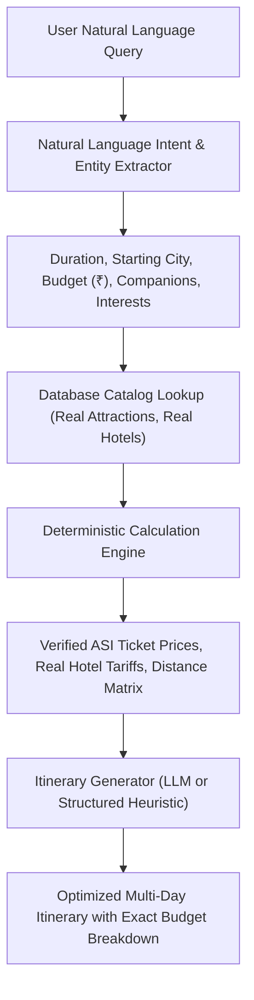

# ExploreBharat AI Engine & Deterministic Travel Planner

## 1. Hybrid Architecture: Generative AI + Deterministic Calculations

A common flaw in travel AI systems is "hallucinating" ticket prices, hotel tariffs, or fake operating hours. ExploreBharat solves this through a **Hybrid Architecture**:

---

## 2. Deterministic Budget Engine

The calculation engine guarantees that monetary allocations correspond to actual costs in India:

1. **Accommodation Cost:**
   $$\text{Hotel Budget} = \text{Target Tier Tariff} \times (\text{Days} - 1) \times \lceil \frac{\text{Travelers}}{2} \rceil$$
2. **Attraction Admission:**
   $$\text{Ticket Budget} = \sum_{\text{Attractions}} \text{Adult Price} \times \text{Travelers}$$
3. **Local Transit & Inter-City:**
   - Budget: Indian Railways (Shatabdi/Vande Bharat/3A) + Metro/Auto
   - Mid-range: AC Sedan Cabs / Intercity Express
   - Luxury: Flights + Dedicated Chauffeur Car
4. **Food & Culinary Tourism:**
   - Calibrated against Indian dining indices (₹800/day for street food/local thalis, ₹1,800/day for fine dining).

---

## 3. Extensible LLM Integration

The AI Service in `apps/api/src/services/ai.service.ts` features a clean interface:
- **Default Mode:** Built-in intelligent heuristic engine that generates rich day-by-day itineraries, morning/afternoon/evening activity recommendations, and practical local advice using real attractions from our database.
- **Provider Hook:** When `AI_API_KEY` is present in the environment (Gemini, Claude, or OpenAI), the service can forward the structured database catalog context into the LLM system prompt to synthesize hyper-personalized narratives while enforcing that prices and opening hours are bound to the verified database values.
