# ExploreBharat — System Architecture & Modular Design

**Product Vision:** *"Discover India. Plan Your Journey."*  
**Architecture Style:** Domain-Driven Modular Monolith (Clean Architecture)  
**Primary Language:** TypeScript across Monorepo (Node.js/Express, Next.js 14, React Native Expo)

---

## 1. High-Level System Architecture

ExploreBharat is structured as a unified **Modular Monolith** using npm workspaces. It avoids distributed-microservice operational complexity while maintaining strict domain separation, shared type safety, and clear boundaries between HTTP controllers, domain services, database access, and UI presentations.

```mermaid
graph TD
    subgraph "Clients Layer"
        WebClient["Web Application (Next.js 14 App Router)"]
        MobileClient["Mobile Client (React Native / Expo Router)"]
    end

    subgraph "Shared Contracts & Database"
        SharedTypes["@bharatyatra/types\n(Domain Interfaces, DTOs, Enums)"]
        PrismaDB["@bharatyatra/database\n(Prisma ORM Client & Migrations)"]
        Constants["Config & Platform Constants\n(PLATFORM_CONSTANTS)"]
    end

    subgraph "Modular API Gateway (apps/api :4000)"
        ExpressApp["Express App & Security Middleware\n(Helmet, CORS, Rate-Limiting, JSON Sanitizer)"]
        AuthMiddleware["JWT Authentication & RBAC Guard\n(USER, VENDOR, ADMIN)"]
        
        subgraph "Business Domain Modules"
            AuthMod["auth/ - JWT & User Identity"]
            AttrMod["attractions/ - Verified National Catalog"]
            DestMod["destinations/ - States, UTs, Cities & Emergency"]
            HotelsMod["hotels/ - Verified Hospitality Inventory"]
            TripsMod["trips/ - Multiday Itinerary & Budget Engine"]
            JourneysMod["journeys/ - Multimodal Door-to-Door Routing"]
            BookingsMod["bookings/ - Ticket & Room Booking State Machine"]
            PaymentsMod["payments/ - Cryptographic HMAC Webhooks & Orders"]
            AdminMod["admin/ - Integrity Engine, Data Center & Audit Logs"]
            VendorsMod["vendors/ - B2B Extranet & 8% Payout Ledger"]
            AnalyticsMod["analytics/ - 8-Stage Conversion Funnel & DAU/WAU"]
        end
    end

    subgraph "External Providers Layer"
        OpenMeteo["Open-Meteo API\n(Live Weather & 3-Day Forecast)"]
        Wikimedia["Wikimedia Commons API\n(Authentic CC-Licensed Photography)"]
        GovData["Data.gov.in / NTES Feeds\n(Official Indian Railways Timetables)"]
        GooglePlaces["Google Places API (New)\n(Attribution-Preserving Place Data)"]
        RazorpayDemo["Razorpay Engine\n(Demo HMAC + Live Banking Hooks)"]
    end

    WebClient -->|HTTP / JSON| ExpressApp
    MobileClient -->|HTTP / JSON| ExpressApp
    WebClient -.-> SharedTypes
    MobileClient -.-> SharedTypes

    ExpressApp --> AuthMiddleware
    AuthMiddleware --> AuthMod
    AuthMiddleware --> AttrMod
    AuthMiddleware --> DestMod
    AuthMiddleware --> HotelsMod
    AuthMiddleware --> TripsMod
    AuthMiddleware --> JourneysMod
    AuthMiddleware --> BookingsMod
    AuthMiddleware --> PaymentsMod
    AuthMiddleware --> AdminMod
    AuthMiddleware --> VendorsMod
    AuthMiddleware --> AnalyticsMod

    AttrMod --> PrismaDB
    HotelsMod --> PrismaDB
    TripsMod --> PrismaDB
    BookingsMod --> PrismaDB
    VendorsMod --> PrismaDB
    AdminMod --> PrismaDB
    AnalyticsMod --> PrismaDB

    AttrMod --> Wikimedia
    JourneysMod --> GovData
    AdminMod --> GooglePlaces
    AdminMod --> OpenMeteo
    PaymentsMod --> RazorpayDemo
```



---

## 2. Monorepo Organization & Workspaces

The monorepo contains 3 application runtimes and 2 shared packages:

```
ExploreBharat/
├── apps/
│   ├── api/                     # Node.js Express Modular REST API (Port 4000)
│   │   ├── src/
│   │   │   ├── config/          # Environment, constants (PLATFORM_CONSTANTS), DB connectors
│   │   │   ├── middleware/      # JWT auth, RBAC, error handler, rate-limiters
│   │   │   ├── modules/         # Domain-driven modules (controller, service, routes)
│   │   │   │   ├── admin/       # Image integrity, data center, audit logs, duplicate detector
│   │   │   │   ├── analytics/   # Funnel analytics, conversion metrics, event ingestion
│   │   │   │   ├── attractions/ # Monuments, ASI data, entry rules, provenance
│   │   │   │   ├── auth/        # Passwords, JWT generation, user registration
│   │   │   │   ├── bookings/    # Tickets, hotel rooms, QR pass generators
│   │   │   │   ├── destinations/# States, districts, cities, emergency contacts
│   │   │   │   ├── hotels/      # Room inventory, real availability, tariffs
│   │   │   │   ├── journeys/    # Multimodal transport planner, fare matrix
│   │   │   │   ├── payments/    # Razorpay HMAC signature verification & webhooks
│   │   │   │   ├── trips/       # Multi-day itineraries, deterministic budget optimizer
│   │   │   │   └── vendors/     # Vendor inventory, reservation management, payout ledger
│   │   │   ├── server.ts        # App bootstrapper, graceful shutdown handlers
│   │   │   └── test.ts          # 66-suite automated integration test runner
│   │   └── dist/                # Compiled JavaScript
│   ├── web/                     # Next.js 14 App Router Web Client (Port 3000)
│   │   ├── src/app/
│   │   │   ├── admin/           # Modularized command center with 8 sub-components
│   │   │   ├── trips/           # Trip planner with extracted budget and item modals
│   │   │   ├── smart-journey/   # Multimodal journey comparator
│   │   │   ├── vendor/          # B2B vendor hospitality extranet
│   │   │   └── ...              # 21 prerendered & dynamic Next.js routes
│   │   └── src/components/      # Reusable UI widgets (SafePlaceImage, Logo, etc.)
│   └── mobile/                  # React Native Expo cross-platform mobile client
│       ├── app/                 # Expo Router screens
│       └── components/          # Native mobile presentation widgets
├── packages/
│   ├── types/                   # Shared TypeScript models, Enums, and DTO contracts
│   └── database/                # Prisma ORM schema (34 models), migrations, and seeds
├── docs/                        # Detailed architectural specifications
└── CODEBASE_AUDIT.md            # Empirical quality report & refactoring roadmap
```

---

## 3. Core Business Domains & Responsibilities

| Module | Core Responsibility | Invariants Enforced |
| :--- | :--- | :--- |
| **Authentication & Users** | User signup, login, JWT issuance, profile updates, and RBAC (`USER`, `VENDOR`, `ADMIN`). | Passwords hashed using bcrypt (10 rounds); admin role cannot be self-assigned on public registration. |
| **Attractions & Provenance** | Authentic discovery across 28 States & 8 UTs. Entry fee rules (`FREE`, `PAID`, `PERMIT_REQUIRED`). | Free attractions reject ticket purchase attempts with HTTP 400. All images retain cryptographic hash & license attribution. |
| **Destinations & Geography** | Regional hierarchies: State -> District -> City. Emergency services and local dining. | State codes normalized to official ISO 3166-2:IN codes (e.g., `RJ`, `TN`, `MH`). |
| **Journeys & Multimodal Routing** | Door-to-door journey planner combining Indian Railways, domestic flights, RTC buses, and cabs. | Zero hallucinated timetables; non-surge regional RTO meter calculations; graceful fallbacks. |
| **Hotels & Hospitality** | Verified room inventory, real starting prices, cancellation terms, and amenities. | No fabricated availability; real room counts decremented atomically upon confirmation. |
| **Trips & Budget Optimization** | Multi-day trip creation, daily timeline slots (`MORNING`, `AFTERNOON`, `EVENING`), and budget calculators. | User ownership isolation (users cannot modify or delete trips belonging to other users). |
| **Bookings & Payments** | Unified ticket & hotel reservation lifecycle (`PENDING` -> `CONFIRMED` -> `CANCELLED`). | Cryptographic HMAC-SHA256 signature verification for payments; idempotent webhook processing. |
| **Vendor Extranet** | Property managers manage room tariffs, reservation ledgers, and check-in statuses. | Platform take rate fixed to 8.0% (`PLATFORM_CONSTANTS.PLATFORM_COMMISSION_RATE`); net vendor payout is 92%. |
| **Admin Operations** | Image integrity auditing (SHA-256 exact matching + dHash perceptual clustering), Google Places sync, and community reviews. | Only `ADMIN` role can approve suggestions or publish new monuments to the national catalog. |

---

## 4. Key Design Decisions & Architectural Trade-Offs

### 1. Modular Monolith vs Microservices
- **Decision:** Build a single, highly structured Express backend rather than 10 separate microservices.
- **Rationale:** ExploreBharat operates as an agile startup. A modular monolith simplifies deployment, enables atomic Prisma database transactions, eliminates network serialization latency, and makes local setup trivial for student and junior developers with a single `npm run dev`.

### 2. Dual Provider Abstraction (`PAYMENT_PROVIDER_MODE=demo | live`)
- **Decision:** Built-in cryptographic HMAC test engine alongside live Razorpay API integration.
- **Rationale:** Allows complete end-to-end booking, payment verification, and webhook testing offline with zero third-party account dependency, while retaining 100% code compatibility with live Razorpay keys in production.

### 3. Separation of Front-End Orchestrator from Screen Tabs
- **Decision:** Refactored monolithic frontend pages (e.g. `apps/web/src/app/admin/page.tsx` from 1,792 lines to 384 lines) into dedicated domain components inside `components/`.
- **Rationale:** Drastically reduces cognitive overhead. A junior developer modifying Image Integrity only needs to read `AdminImageIntegrityTab.tsx` (160 lines) rather than navigating a 92 KB monolithic file.

### 4. Elimination of Magic Numbers & Strings
- **Decision:** Centralized constants in `PLATFORM_CONSTANTS` ([constants.ts](file:///c:/Users/selva/Desktop/Projects/ExploreBharat/apps/api/src/config/constants.ts)).
- **Rationale:** Prevents drift between financial calculations (e.g. 8% take rate in analytics vs 8% in vendor ledger), ensures bounded pagination limits (max 100 items), and standardizes Earth radius (6,371 km) for Haversine distance computations.

---

## 5. Security & Isolation Controls

1. **Authentication:** Stateless Bearer JWT tokens signed with server-side secrets. Expiration enforced.
2. **Role-Based Access Control (RBAC):** Middleware checks verify user claims (`requireRole('ADMIN')`, `requireRole('VENDOR')`).
3. **Cross-Tenant & IDOR Protection:** Service queries enforce user ownership (`where: { id: tripId, userId: currentUser.id }`).
4. **Input Sanitization & Validation:** Strict DTO validation prevents SQL/Prisma injection and parameter tampering.
5. **Image Provenance:** SHA-256 exact-match checksums and dHash perceptual hashing block counterfeit or duplicate imagery.
6. **Payment Tampering Defense:** Server recalculates expected order amounts; client-supplied price manipulations are rejected with HTTP 400.
