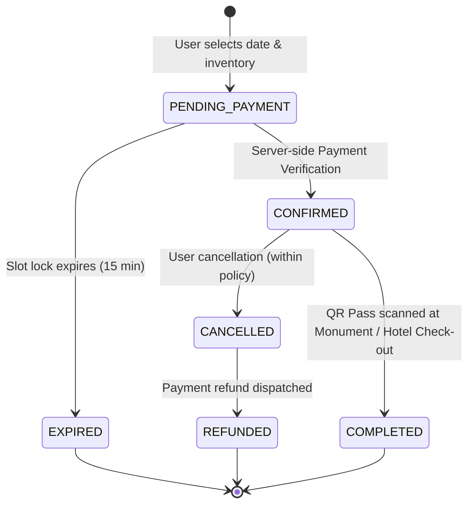

# ExploreBharat Booking Architecture & State Machine

## 1. Booking State Machine

All bookings in ExploreBharat (attraction admission tickets, hotel stays, tourism circuit passes) are governed by a deterministic, non-bypassable state machine:



---

## 2. Inventory Reservation & Concurrency Safety

1. **Pre-flight Lock:** When a traveler initiates booking, the system checks `TicketInventory` for the specific `(ticketTypeId, date, timeSlot)` composite key.
2. **Atomic Increment:** The query confirms `bookedCount + quantity <= totalCapacity` before committing the reservation inside a Prisma transactional block.
3. **Provider Routing:**
   - For internal monuments & partner sites: Updated directly in platform database.
   - For Archaeological Survey of India (ASI) or state government monuments: Delegated to `GovernmentAsiProvider` adapter with official booking token.

---

## 3. Cryptographic QR Pass Generation

Every confirmed booking automatically generates a cryptographically signed JSON payload formatted into a verifiable 2D QR Code:

```json
{
  "ref": "BY-TK-2026-15024",
  "attraction": "Amber Palace & Fort",
  "date": "2026-10-15",
  "slot": "09:00 - 11:00 AM",
  "holder": "Aarav Sharma",
  "guestCount": 2,
  "status": "CONFIRMED",
  "issuedAt": "2026-10-06T10:49:32Z"
}
```

### Verification Flow at Monument Turnstile:
1. Turnstile agent or turnstile camera scans the visitor's mobile/printed QR code.
2. The scanner sends the scanned string to `POST /api/tickets/verify-qr`.
3. The server checks the reference, confirms the date matches today's visit window, validates status is `CONFIRMED`, and marks the pass as `CHECKED_IN` to prevent double-entry fraud.

---

## 4. Hotel Check-In Architecture

Hotel reservations follow a multi-night occupancy model:
1. Calculates `numberOfNights = (checkOutDate - checkInDate)`.
2. Computes base rate: `baseRatePerNight * numberOfNights * roomCount`.
3. Computes GST (Goods & Services Tax in India):
   - Rooms under ₹7,500/night: 12% GST
   - Luxury suites above ₹7,500/night: 18% GST
4. Issues a verifiable digital voucher with hotel front-desk check-in instructions.
