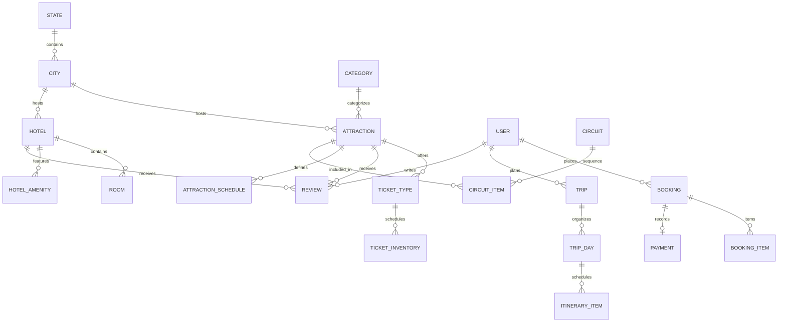

# ExploreBharat Database Architecture & Relational Schema

ExploreBharat uses **Prisma ORM** with a normalized relational database design supporting PostgreSQL in production and SQLite in zero-dependency local development environments.

## 1. Entity-Relationship Overview



---

## 2. Core Entities

### Geographical Hierarchy
- **State (`states`)**: Represents all 28 Indian States and 8 Union Territories with official state codes, capital cities, and descriptive summaries.
- **City (`cities`)**: Tourist urban and rural destinations equipped with latitude, longitude, best seasons to visit, and connectivity details.

### Attractions & Heritage Inventory
- **Category (`categories`)**: Heritage, Forts, Palaces, Religious, Nature, Wildlife, Adventure, Beaches, Cultural, and Hidden Gems.
- **Attraction (`attractions`)**:
  - `id`, `name`, `slug`, `description`, `heroImage`, `gallery` (JSON)
  - `latitude`, `longitude`, `address`, `cityId`, `categoryId`
  - `bestTimeToVisit`, `expectedDurationMinutes`
  - **Source Attribution:** `sourceType`, `sourceName`, `sourceUrl`, `verificationStatus`, `lastVerifiedAt`
  - **Accessibility Flags:** `isWheelchairAccessible`, `hasParking`, `hasRestrooms`, `hasFood`
- **AttractionSchedule (`attraction_schedules`)**: Weekday operating hours (`openTime`, `closeTime`, `isClosed`).
- **TicketType (`ticket_types`)**: Tiered pricing by nationality and age (`DOMESTIC_ADULT`, `DOMESTIC_CHILD`, `FOREIGN_ADULT`, `VIP_FAST_TRACK`, `STUDENT_PASS`).
- **TicketInventory (`ticket_inventory`)**: Hourly inventory tracking (`date`, `timeSlot`, `totalCapacity`, `bookedCount`).

### Hospitality Architecture
- **Hotel (`hotels`)**: Properties linked to cities and geographic coordinates, featuring star tiers, check-in policies, and amenities.
- **Room (`rooms`)**: Room tiers (`Deluxe Heritage Suite`, `Executive King Room`, `Royal Villa`) with base nightly rates, capacity, and bed arrangements.
- **HotelAmenity (`hotel_amenities`)**: Wi-Fi, swimming pool, authentic restaurant, parking, spa, airport shuttle.

### Bookings & Ledger
- **Booking (`bookings`)**:
  - `id`, `bookingReference` (e.g. `BY-TK-2026-XYZ`), `userId`, `type` (`ATTRACTION_TICKET` | `HOTEL_RESERVATION` | `CIRCUIT_PASS`)
  - `status` (`CONFIRMED`, `PENDING_PAYMENT`, `CANCELLED`, `COMPLETED`, `REFUNDED`)
  - `totalAmount`, `taxAmount`, `discountAmount`, `netAmount`
  - `qrCodeData`, `cancellationReason`, `refundAmount`
- **BookingItem (`booking_items`)**: Specific line items capturing quantity, unit price, date, and time slot.
- **Payment (`payments`)**:
  - Transaction ledger recording payment gateway orders, transaction IDs, HMAC signatures, and refund identifiers.

### Trip Planner & AI Itineraries
- **Trip (`trips`)**:
  - User-created trip with `name`, `startDate`, `endDate`, `totalBudget`, `travelerCount`, `travelCompanions`, `interests`.
- **TripDay (`trip_days`)**:
  - Day 1, Day 2, etc., mapped to calendar dates.
- **ItineraryItem (`itinerary_items`)**:
  - Scheduled items mapped to `attractionId` or custom activities with time slots (`MORNING`, `AFTERNOON`, `EVENING`), duration, cost estimates, and notes.

---

## 3. Database Migration & Seeding

```bash
# Apply schema to database
npx prisma db push

# Generate Prisma Client
npx prisma generate

# Populate 268 verified attractions and fixtures
npm run seed
```
