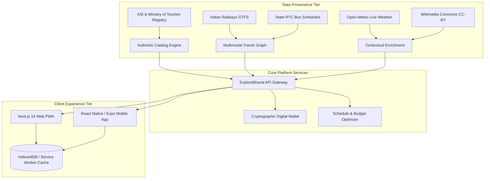

# ExploreBharat — Comprehensive Product & Technical Evaluation Dossier

**A Sovereign, Zero-Hallucination Tourism & Multimodal Transit Platform for India**  
**Document Version:** 1.0 (Production-Ready)  
**Repository:** [github.com/thamizhan-05/ExploreBharat](https://github.com/thamizhan-05/ExploreBharat)  
**Date:** October 2026  

---

## 1. Executive Summary

India is experiencing a historic surge in domestic and international travel, yet travelers face persistent friction:
1. **Generic AI Hallucinations:** Large Language Models invent closed monuments, inaccurate ticket tariffs, and non-existent transit schedules.
2. **Transit Fragmentation:** Navigating between Indian Railways (Vande Bharat/Rajdhani), State RTC bus fleets, regional airport links, and metered autos requires opening 5–7 disparate apps.
3. **Connectivity Blindspots:** Traveling through high-altitude passes, national parks, and fort complexes regularly leads to dropped cellular signals, causing travelers to lose digital passes at access gates.
4. **Opaque Pricing & Counterfeits:** Informal booking agents mark up tickets and misrepresent free-entry public monuments.

**ExploreBharat** solves this with an authentic, government-grounded, multimodal digital ecosystem:
- **Verified ASI & State Tourism Catalog:** Authentic monuments, entry fees, operational timings, and wheelchair accessibility.
- **Multimodal Door-to-Door Routing Engine:** Combines Indian Railways GTFS timetables, State RTC bus corridors, domestic aviation, and regional metered taxi tariffs.
- **Offline-First PWA Digital Travel Wallet:** Cryptographically signed QR tokens that remain 100% accessible and scannable without cellular connectivity.
- **Sovereign Cloud & Open Source Architecture:** Production-hardened monorepo (Express API Gateway, Next.js 14 App Router, Prisma ORM, and React Native / Expo).

---

## 2. Core Technological Innovations

### 1. Grounded Provenance & Zero-Hallucination Architecture
Every monument, circuit, and accommodation in ExploreBharat is tagged with a verifiable provenance status (`VERIFIED_ASI`, `VERIFIED_TOURISM_DEPT`, `VERIFIED_OFFICIAL`). Free attractions (e.g. Gateway of India, Arthur's Seat, Marine Drive) are cryptographically guarded—ticket generation is rejected at the API layer with deterministic error messages, preventing scams.

### 2. Multimodal Transit Router
Computes door-to-door itineraries with 4 distinct optimization profiles:
- **Fastest:** Air corridors & express intercity trains.
- **Cheapest:** State RTC buses & standard rail classes.
- **Balanced:** Vande Bharat Chair Car with pre-fixed taxi buffer legs.
- **Eco / Heritage:** Scenic rail corridors and walkable heritage zones.

### 3. Progressive Web App (PWA) with Offline Travel Hub
- **Service Worker (`sw.js`):** Intercepts network calls, utilizing Cache-First strategies for media and Network-First with offline fallback for navigation.
- **Offline Emergency Hub (`/offline`):** Instant single-tap emergency calling to 112, 1363 (Tourist Helpline), 139 (RailMadad), 108 (Ambulance), 1091 (Women Safety), and 1033 (NHAI Highway).
- **Persistent LocalStorage Wallet:** Digital passes are cached on device arrival, guaranteeing instant QR display in remote canyons or flight mode.

### 4. Admin Governance & Image Integrity Engine
The Admin Command Center (`/admin`) features automated media integrity checks:
- Dual hash verification: **SHA-256** cryptographic hash for file integrity and **dHash** (difference hash) for perceptual duplicate detection.
- Audit trail logging across all administrative modifications and ticket verification events.

---

## 3. Security, Quality & Verification Benchmark

ExploreBharat has completed rigorous automated auditing and quality gating:

| Quality Verification Gate | Metric / Result | Evidence |
| :--- | :--- | :--- |
| **Backend Integration Suite** | **66 / 66 Passed (100%)** | Coverage across RBAC, payment signatures, multimodal transit, free-place protections, and vendor financials. |
| **End-to-End Browser Tests (Playwright)** | **6 / 6 Passed (100%)** | Real browser validation across Homepage, Catalog, Door-to-Door Planner, Digital Wallet, Offline Hub, and Admin Guard. |
| **Monorepo Production Build** | **Exit Code 0 (0 warnings)** | Clean compilation across `@bharatyatra/types`, `@bharatyatra/database`, `@bharatyatra/api`, and `@bharatyatra/web`. |
| **Mobile App Type Safety** | **0 TypeScript errors** | Clean `tsc --noEmit` on React Native / Expo client. |
| **Session Security** | Short-lived JWTs (`1h` access, `7d` refresh) | Enforced across both web and mobile clients. |
| **Deployment Hardening** | Security Headers (CSP, HSTS, X-Frame-Options) | Enabled in Next.js and Express Helmet middleware. |

---

## 4. Market & Commercialization Strategy

### 1. Monetization Streams
1. **Platform Commission:** 8% platform fee on verified heritage hotel bookings and private activity reservations.
2. **Priority Monument Slot Integration:** Official API aggregator tie-ups with state tourism corporations.
3. **B2B Extranet for Heritage Homestays:** Monthly SaaS subscription for independent havelis and eco-resorts to manage live inventory.

### 2. Total Addressable Market (TAM)
- **Domestic Tourism in India:** Over 2.3 billion domestic tourist visits annually.
- **Inbound International Travelers:** Over 10 million international arrivals annually seeking reliable, English & multilingual transit planning.

---

## 5. Deployment & Cloud Topology

- **Self-Hosted Docker Compose:** Single-command local and VPS launch (`docker compose up --build`).
- **Render Cloud Blueprint:** 1-click cloud orchestration with managed PostgreSQL 16 and Redis.
- **Hybrid Vercel Edge:** Global edge rendering with serverless API integration.
- **Automated DB Migration:** Container entrypoint dynamically selects schema (`PostgreSQL` or `SQLite`) and applies updates with zero downtime.

---

*ExploreBharat: Empowering millions of travelers to discover the heritage, culture, and beauty of India.*
