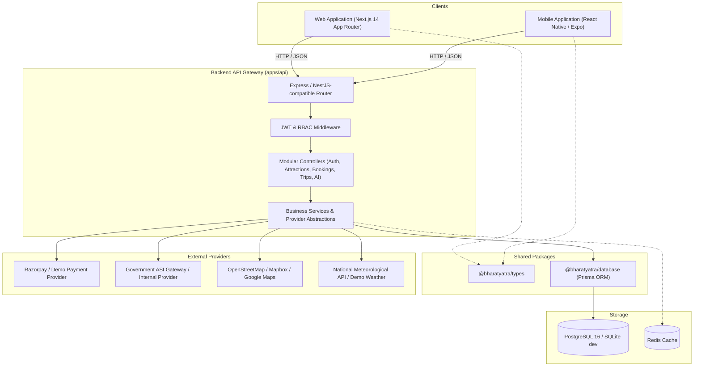

# ExploreBharat Architecture & System Design

## 1. High-Level Architecture

ExploreBharat is designed around a unified **Monorepo Architecture** that enforces a single source of truth for TypeScript types, business rules, API contracts, and database schemas across both Web and Native Mobile clients.



---

## 2. Cross-Platform Synchronization

### A. Shared Type Safety (`@bharatyatra/types`)
To guarantee that neither web nor mobile deviates from API contracts, both clients import strictly typed interfaces directly:
- `Attraction`, `AttractionDetailResponse`, `AttractionCategory`
- `Booking`, `BookingItem`, `CreateTicketBookingDto`, `CreateHotelBookingDto`
- `Trip`, `TripDay`, `ItineraryItem`, `CreateTripDto`, `TripBudgetBreakdown`
- `AITripPlanRequest`, `AITripPlanResponse`
- `User`, `UserRole`, `LoginResponse`

### B. Same Backend REST API
Both clients consume endpoints rooted at `/api/*`:
- Standardized error envelopes: `{ success: false, error: "DESCRIPTIVE_MESSAGE" }`
- Standardized success envelopes: `{ success: true, data: { ... } }`
- Bearer token authentication in `Authorization: Bearer <JWT>` header

---

## 3. Provider Abstraction Pattern

The platform avoids tight coupling to any third-party vendor by establishing clean abstract contracts:

### A. Booking Providers (`BookingProvider`)
```typescript
export interface BookingProvider {
  name: string;
  checkAvailability(attractionId: string, date: string, slotId?: string): Promise<boolean>;
  reserveTickets(params: TicketReservationParams): Promise<ReservationResult>;
  cancelReservation(bookingRef: string): Promise<boolean>;
}
```
Implemented providers:
1. `InternalProvider`: Directly updates `TicketInventory` and manages venue capacity.
2. `GovernmentAsiProvider`: Formats requests for archaeological survey monuments with official security tokens.

### B. Payment Providers (`PaymentProvider`)
```typescript
export interface PaymentProvider {
  createOrder(amount: number, currency: string, receipt: string): Promise<PaymentOrder>;
  verifyPayment(orderId: string, paymentId: string, signature: string): Promise<boolean>;
  refund(paymentId: string, amount?: number): Promise<RefundResult>;
}
```
Implemented providers:
1. `DemoPaymentProvider`: Zero-friction simulated payment ledger for development and local testing.
2. `RazorpayProvider`: Cryptographic HMAC SHA256 signature verification matching Razorpay's official merchant protocol.

---

## 4. Location Hierarchy & Geospatial Services

ExploreBharat models India's geographical structure using a strict 5-tier relational hierarchy:

1. **Country:** India (`IN`)
2. **State / Union Territory:** 28 States + 8 UTs (e.g., Rajasthan, Kerala, Ladakh, Tamil Nadu)
3. **District:** Administrative subdivision
4. **City / Town:** Primary destination hub (e.g., Jaipur, Kochi, Leh, Varanasi)
5. **Attraction / Locality:** Precise destination equipped with WGS84 `latitude` and `longitude` coordinates.

### Geospatial Calculations:
- The backend utilizes the Haversine formula to compute great-circle distances between points:
  $$\Delta \sigma = 2 \arcsin \left( \sqrt{ \sin^2\left(\frac{\Delta \phi}{2}\right) + \cos(\phi_1)\cos(\phi_2)\sin^2\left(\frac{\Delta \lambda}{2}\right) } \right)$$
- Powers the **"Near Me"** feature on mobile and the **Nearby Hotels / Restaurants** sections on attraction pages.
- Seamlessly transitions to native PostGIS functions (`ST_DWithin`, `ST_Distance`) when deployed against production PostgreSQL.
